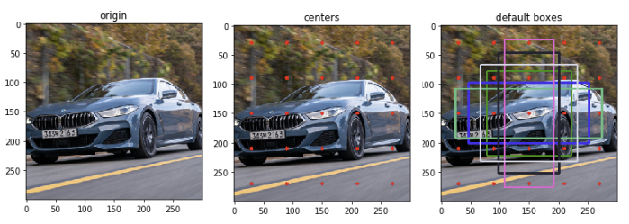

# ssd_defaultbox_generator
This is an implementation of default box generating algorithm of the paper[1], SSD: Single Shot Multibox Detector.  
Full paper review in Korean can be seen here[2].

## Reference
[1] W. Liu, et al, SSD: Single Shot Multibox Detector, 2016, ECCV  
[2] 갈아먹는 머신러닝, https://yeomko.tistory.com/20
